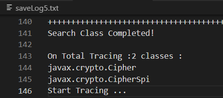
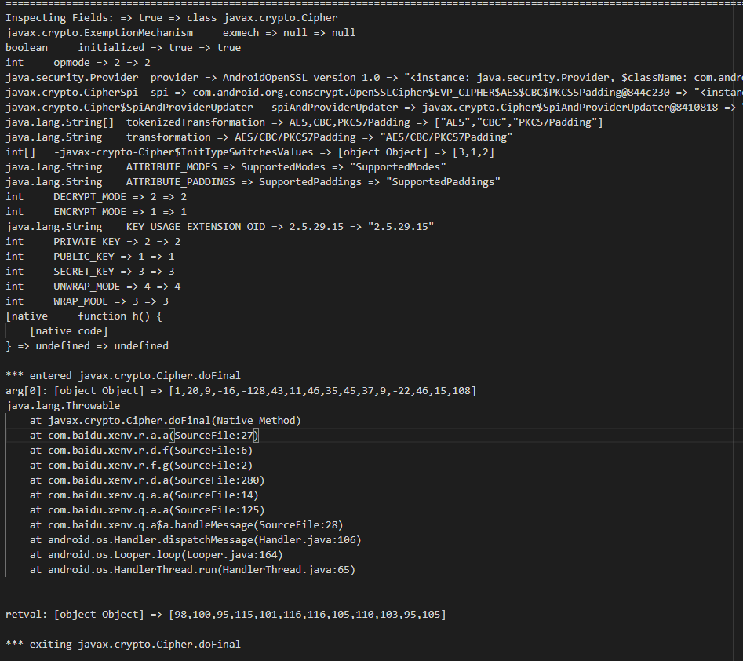
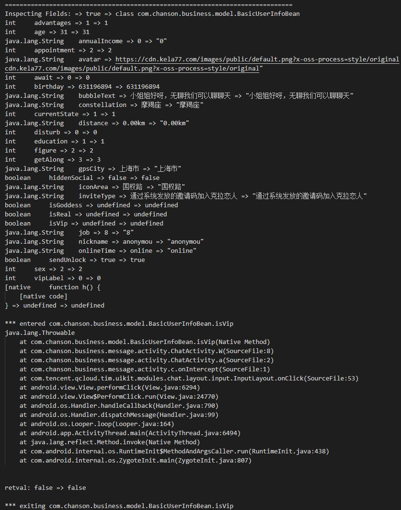
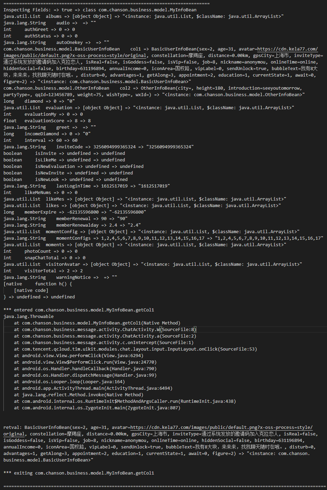
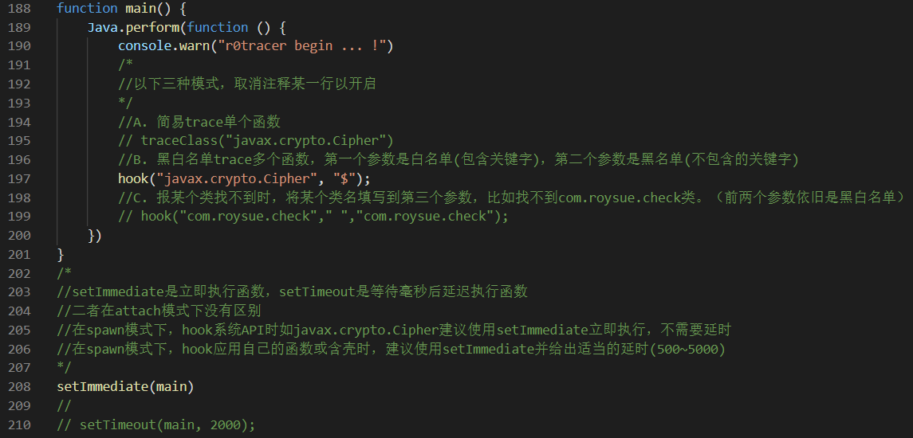

# 2023-6-15更新：

- 基于最新Frida16
- 新增iOS平台支持且自动判断应用所属平台
- 输出信息非常全面，iOS平台对property的访问也被hook并输出
- 新增hookALL()模式，hook应用的所有类方法重载；（小应用可用，大应用扛不住）

# r0tracer

安卓Java层多功能追踪脚本

> AKA：精简版 objection + Wallbreaker


# 功能：

- 根据黑白名单批量追踪类的所有方法

hook("javax.crypto.Cipher", "$");



- 在命中方法后打印出该类或对象的所有域值、参数、调用栈和返回值





- 极简的文本保存日志机制、易于搜索关键参数

- 针对加壳应用找不到类时可以切换Classloader

# 使用方法：

1. 修改`r0tracer.js`文件最底部处的代码，开启某一个Hook模式。



2. 推荐使用Frida14版本，并且将日志使用`-o`参数进行输出保存

```
$ frida -U -f com.r0ysue.example -l r0tracer.js  --no-pause -o saveLog5.txt
```

> "-f"为Spawn模式，去掉"-f"为Attach模式

3. Frida版本=<12时，要加上`--runtime=v8`选项

```
$ frida -U com.r0ysue.example -l r0tracer.js  --runtime=v8 --no-pause -o saveLog6.txt
```


# 优势

- 比`objection`增加延时`spawn`
- 比`objection`增加批量`hook`类\方法\构造函数
- `Wallbreaker`在`frida14`上还是一直崩
- 比`Wallbreaker`增加`hook`看`instance`的`fields`
- `inspectObject`函数可以单独拿出去使用

注意点：

- Frida的崩溃有时候真的是玄学，大项目一崩溃根本不知道是哪里出的问题，这也是小而专的项目也有一丝机会的原因
- Frida自身即会经常崩溃，建议多更换Frida(客/服要配套)版本/安卓版本，`ROOT`采用`Magisk Root`
- 我自己常用的组合是两部手机，Frida12.8.0全家桶+[Google Factoty Image](https://developers.google.com/android/images) Android 8.1.0，和Frida14.2.2全家桶+[Google Factoty Image](https://developers.google.com/android/images) Android 10 

# 致谢 Thanks to

|项目|链接|
|:-:|:-:|
|objection|https://github.com/sensepost/objection|
|Wallbreaker|https://github.com/hluwa/Wallbreaker|
|hacking-frida|https://awakened1712.github.io/hacking/hacking-frida/|

